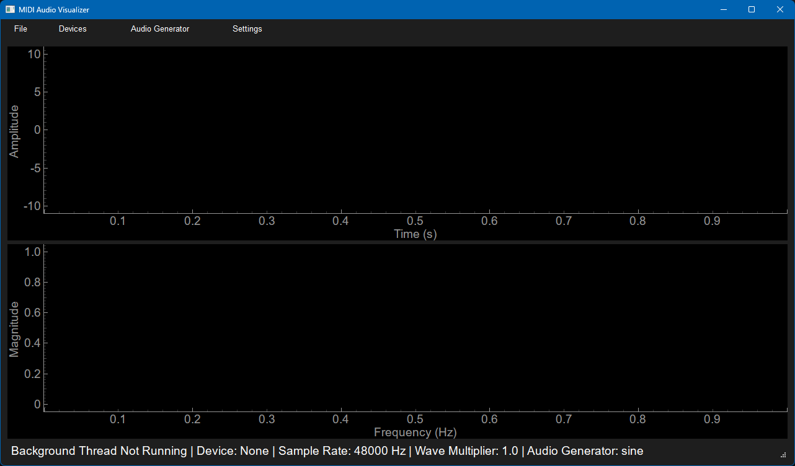
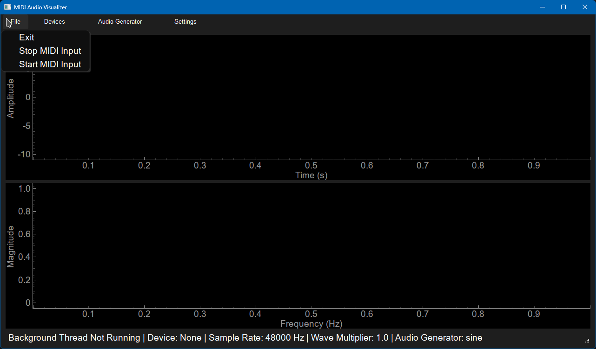
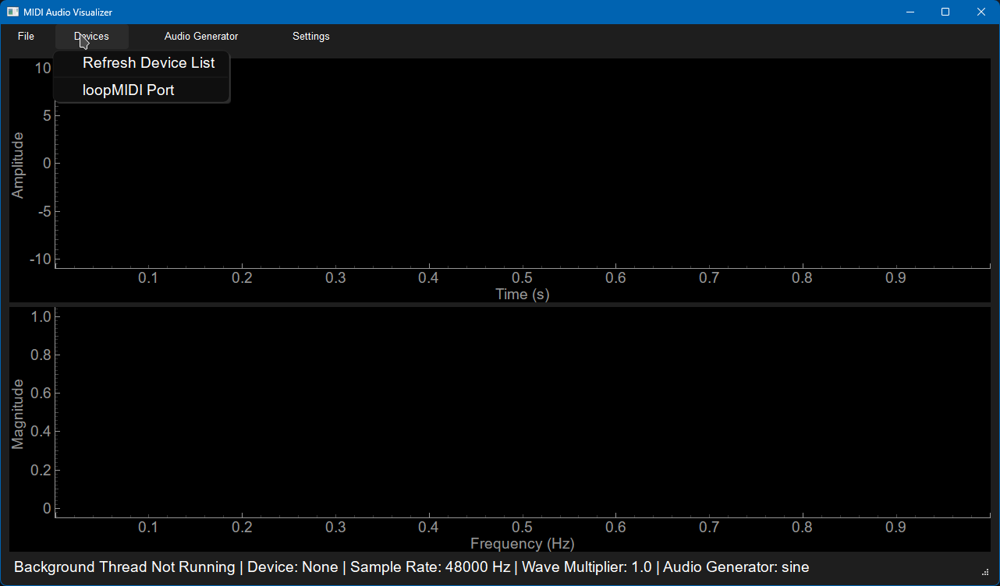
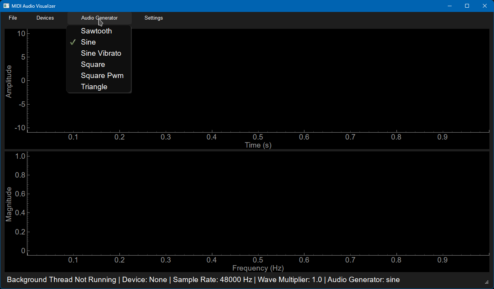
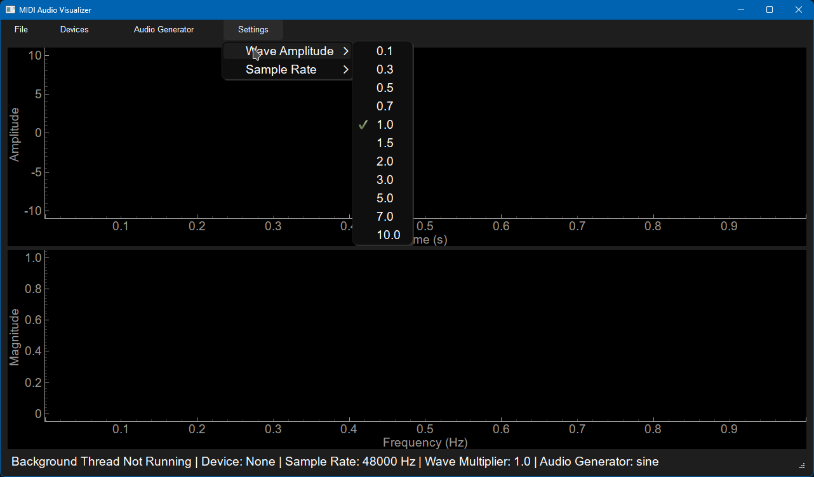
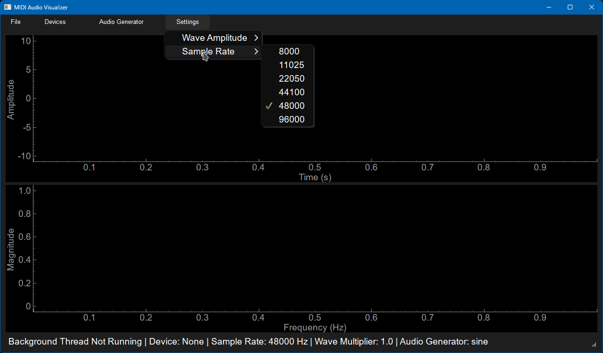
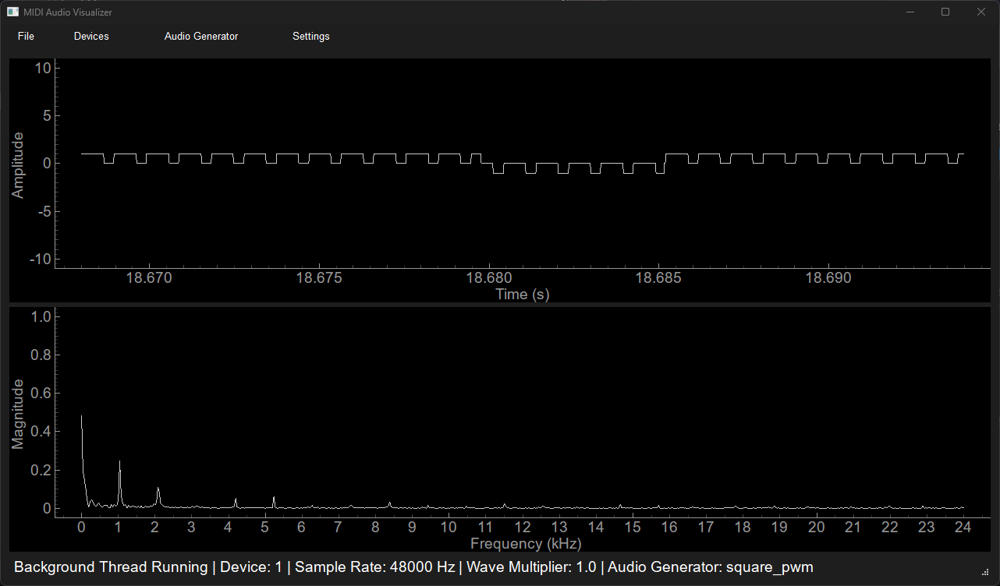

# Audio Midi Vizualiáció

## Használt csomagok:

| Csomag      | Használat                                                      |
| ----------- | -------------------------------------------------------------- |
| pyside6     | Grafikus megjelenítés                                          |
| pyqtgraph   | Grafikon plotolás ui-on                                        |
| pygame      | midi device interface                                          |
| numpy       | Hang adat kiszámtása tárlása                                   |
| sounddevice | Hang adat lejátszása                                           |
| widgtes     | Saját csomag, audio generálás és a midi eszköz kezelés szolgás |

## Használat

### Telepítés

Elsőnek le szedjűk a repo-t.

```bash
git clone https://github.com/OwnSample-hash/hal.git
cd hal
```

Majd a szükséges függőségeget telepíteni lehet a következő parancsal

```bash
# pip esetén ezzel a parancsal lehet leszedni pipenv-et
pip install pipenv
# ha a rendszer kezeli a python packaget akkor a csomag kezelő segítségével szerezhetőbe

python -m pipenv install
```

Futatni pedig a következő parancsal lehet:

```bash
python -m pipenv run python ./main.py
```

### Használat

Ha sikeresen elindul a program akkor a következő kép fogat minket



A menusoron különbözö beállításokat lehet elvégezni

#### Fájl



- Kilépni
- Leállítani a MIDI input-ot
- Elindítani egy leállított MIDI input-ot

#### Devices



- A MIDI eszközk újra frissítése
- Ha van MIDI eszköz akkor ki lehet azt választani, ha nincsen akkor egy hiba elem fogad minket

#### Audio Generators



- Swatooth (fűrész)
- Sine (szinusz)
- Sine Vibrato (szinusz vibrato)\*
- Square (négyzet)
- Square PWM (négyzet PWM)\*
- Tringle (háromszög)

\* Támogatja a Mod Wheel/Pitch Bend-et különböző paraméterek modosítására

#### Wave Amplitude



#### Sample Rate

Fel vagy lekicsinyíti a grafikon képet



Mintavételezés gyakorisága

#### Futás közben



Ha kiválasztottunk egy MIDI eszközt akkor, a gombok, illetve a mod wheel/pitch bend hatására tudjuk változtani a generált jelet.
A felső grafikonon meglejenik a jel idő szereinti leképezése, az alatta lévőn pedig a frekvenciák szerint jelenik meg fft segítségével.

## Fájlok / osztályok

### `main.py`

#### `SimpleApp(QtWidgets.QWidget)`

A fő osztály ami a qt6 os ui-t írja le. Tartalmaz egy `menubar`, `statusbar`, és kettő grafikont. Egyet a fft-nek a másikat pedig időszerint.

### `widgets/audioGen.py`

#### `AudioGens`

Otthont add a audio generátoroknak. Ha példányosítjuk az osztályt akkor el lehet érni a különbzö generátorokat a `["sine"]` modón. A `__getitem__` metódus segítségével érji el.

#### `SignalCommunicator(QObject)`

Jel kummonikátor osztály ami tartalmazza a `update_plot` Jelet ami egy tupelt vár. A fő ui feliratkozik erre és az `AudioGen` osztály meg `emit`-el kibocsálytja az új hang jelet.

#### `AudioGen(QObject)`

Össze fűzi a `SignalCommunicator`-t meg a `AudioGen`-t és hangot állít elő.

### `widgets/chooseDev.py`

#### `ChooseDev(QtWidgets.QMenu)`

Egy egész menu elemet definiál. Lehet midi eszközt választani és ki olvassa a midi üzeneteket.

## Felosztás

### Nagy Máté Milán

- Audio Generátorok
- MIDI eszköz kezelés

### Ruskó Olivér

- QT6 UI
- MIDI eszköz kezelés
